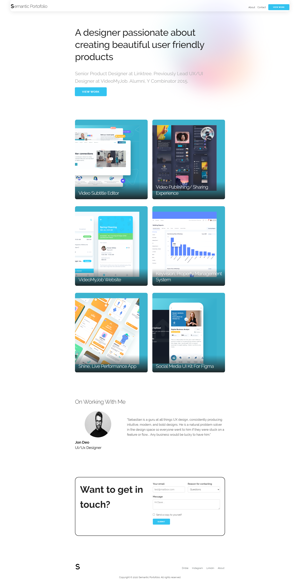
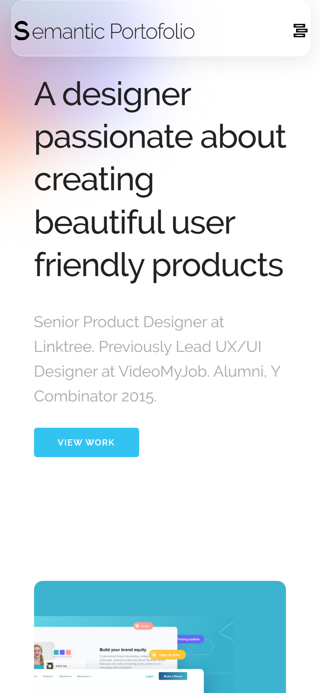
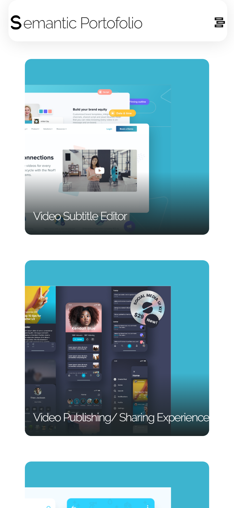
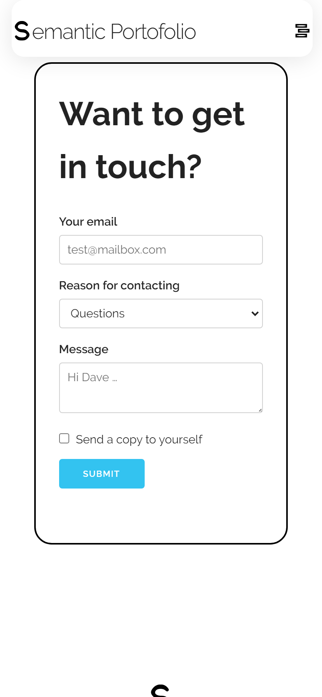

<center>
    <h1>Astro Semantic Portfolio 📷</h1>
    
    
    
    
   
</conter>


# Semantic Portfolio Astro Course  ❤️‍🔥


### Desciption ✨
Astro is Web Framework that can make fast websits with simplicity work , in this course we explain how to make Portfolio website with Astro

## Technologies 🚀

### Frontend 👾 
 - [HTML & CSS ](https://www.youtube.com/playlist?list=PLGMjH0KDBZRh-Q3zNMT_QN4rWGxg-Otjg)
 - [Javascript](https://www.youtube.com/playlist?list=PLGMjH0KDBZRi6kBYPPhkQG8zQ0GkkXNVz)
 - [Typescript](https://www.youtube.com/playlist?list=PLGMjH0KDBZRjlmRBQJOVvZluUE73azwQZ)
 - [Skeleton](http://getskeleton.com/#intro)
 - [Astro](https://astro.build/)


 ### Backend 🤖
 - [Astro](https://astro.build/)


## Install ✌️

To Install new Project  run

```bash
  npm create astro@latest
```


## Features 👓

- Some Animation Ui 
- Use Skeleton Css Framework 
- Very Fast 
- Build static websites very fast 


## Run Locally 🧑🏼‍✈️

Clone the project

```bash
  git clone https://github.com/udc2020/astro-portfolio.git
```

Go to the project directory


Install dependencies

```bash
  npm install
```

run app

```bash
  npm run dev
```


